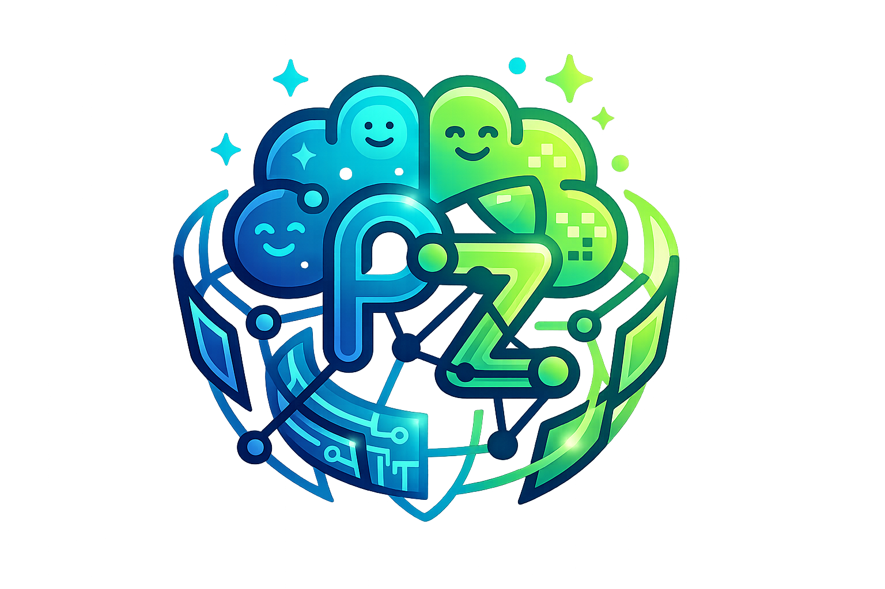

[index.html](https://github.com/user-attachments/files/27232948/index.html)
<!DOCTYPE html>
<html lang="ar" dir="rtl">
<head>
    
    <meta charset="UTF-8">
    <meta name="viewport" content="width=device-width, initial-scale=1.0">
    <title>Profzon</title>
    
    <link rel="stylesheet" href="https://cdnjs.cloudflare.com/ajax/libs/font-awesome/6.0.0/css/all.min.css">
</head>
<body>

   <header>
    

        
        <h1 style="color: rgb(41, 146, 178); margin: 0;">ZON</h1>
        <h1 style="color: rgb(97, 225, 136); margin: 0;">PROF</h1>
    

    <nav class="navbar">
        

    <input type="text" class="search-input" placeholder="ابحث عن تكنولوجيا المستقبل...">
    <button class="search-button">
        <i class="fas fa-search"></i>
    </button>

        

            
            
            
        

        <ul class="nav-links">
            <li><a href="explore.html">مسارات تكنولوجيا</a></li>
            <li><a href="contact us.html">اتصل بنا</a></li>
            <li><a href="#" onclick="logout()">تسجيل الخروج</a>

</li>
            
            
        </ul>
    </nav>
</header>

    <section class="hero">
    <h1>مرحباً بك في منطقة الاحتراف</h1>
    
بوابتك لاستكشاف أحدث التقنيات بلمسة خبير. نحن لا ننقل الخبر، بل نحلله.

    
    <a href="explore.html" style="text-decoration: none;">
        <button class="btn-main">استكشف</button>
    </a>
</section>
<section class="latest-posts">
    <h2 class="section-title">آخر التحليلات التقنية</h2>
    
    

        

            

            

                ذكاء اصطناعي
                <h3>كيف سيغير GPT-5 مفهوم البرمجة؟</h3>
                
تحليل عميق للقدرات المتوقعة للنموذج القادم وتأثيره على سوق العمل...

               
            <a href="asi.html" href="#" class="read-more">اقرأ المزيد ←</a>
            

        

        

            

            

                أمن سيبراني
                <h3>أخطر ثغرات عام 2026 وكيف تتجنبها</h3>
                
دليلك الشامل لحماية بياناتك من هجمات الفدية المتطورة باستخدام AI...

                <a href="#" class="read-more">اقرأ المزيد ←</a>
            

        

        

            

            

                الواقع الممتد
                <h3>مراجعة نظارة Apple Vision Pro 2</h3>
                
هل استطاعت أبل حل مشاكل الوزن والبطارية في الجيل الثاني؟

                <a href="#" class="read-more">اقرأ المزيد ←</a>
            

        

    

</section>

    <footer>
        
&copy; 2026 جميع الحقوق محفوظة لمدونة <strong>Profzon</strong>

    </footer>
    
</body>
</html>
